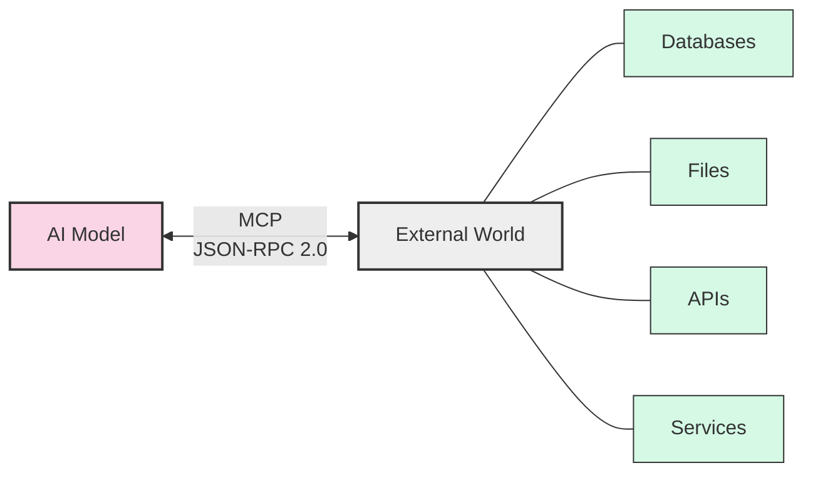
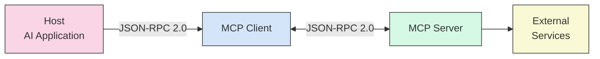

# Model Context Protocol (MCP) Learning Guide

## What is MCP?

The **Model Context Protocol (MCP)** is an open standard that connects AI models to external data sources and tools. Think of MCP as a **"universal translator"** between AI systems and the outside world - just like USB-C provides one port for many devices, MCP provides one protocol for many data sources.



## How MCP Works

MCP uses a **client-server architecture** with **JSON-RPC 2.0** for communication:

1. **Host**: The AI application (like Claude or VS Code)
2. **Client**: Connector that sends requests to servers
3. **Server**: Programs that provide data/tools to AI



## JSON-RPC 2.0 Communication

All MCP communication uses **JSON-RPC 2.0** messages. Here's a simple example:

**Request** (Host asks for available tools):
```json
{
  "jsonrpc": "2.0",
  "id": 1,
  "method": "tools/list",
  "params": {}
}
```

**Response** (Server lists available tools):
```json
{
  "jsonrpc": "2.0",
  "id": 1,
  "result": {
    "tools": [
      {
        "name": "searchFiles",
        "description": "Search for files in directory"
      }
    ]
  }
}
```

## Project Overview
This repository contains practical guides, tutorials, and examples for learning and working with MCP. Perfect for beginners who want to understand MCP concepts and build their own servers and clients.

## Sections

### 1. Concept Deep Dive
Comprehensive beginner's guide with visual explanations:
- ✅ Complete MCP protocol overview with analogies
- ✅ Core concepts (hosts, clients, servers) explained
- ✅ Architecture diagrams with JSON-RPC 2.0 details
- ✅ Building blocks: Resources, Tools, and Prompts
- ✅ Security considerations and real-world adoption

[**📖 Start with the Concept Deep Dive →**](./concept-deep-dive/README.md)

### 2. Hands-on: Access Existing Server
Learn how to connect to and use existing MCP servers:
- TODO: Setting up connection to MCP servers
- TODO: Authentication methods
- TODO: Basic communication patterns

### 3. Hands-on: Build MCP Server
Step-by-step guide to creating your own MCP server:
- TODO: Server implementation basics
- TODO: Handling connections and messages
- TODO: Adding custom functionality

### 4. Hands-on: Build Client with UI
Create a client application with a user interface:
- TODO: Client architecture overview
- TODO: UI integration concepts
- TODO: Example implementations

### 5. Explore & Demo Popular Servers
Examples of existing MCP servers and their features:
- TODO: Overview of popular implementations
- TODO: Feature comparison
- TODO: Usage examples

### 6. Demo: Virtual Assistant Engineer
Building a virtual assistant using MCP:
- TODO: Assistant architecture
- TODO: Integration patterns
- TODO: Example implementation

### 7. Security Challenges & Solutions
Security considerations when working with MCP:
- TODO: Common security challenges
- TODO: Best practices
- TODO: Implementation techniques

## Getting Started
1. Clone this repository
2. Explore the folders in order or jump to a specific topic
3. Each section contains a README with specific guidance and code examples
