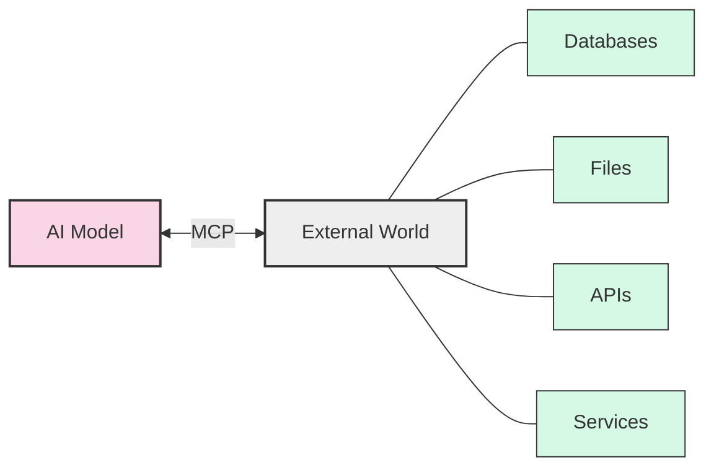
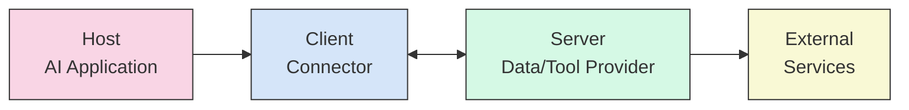
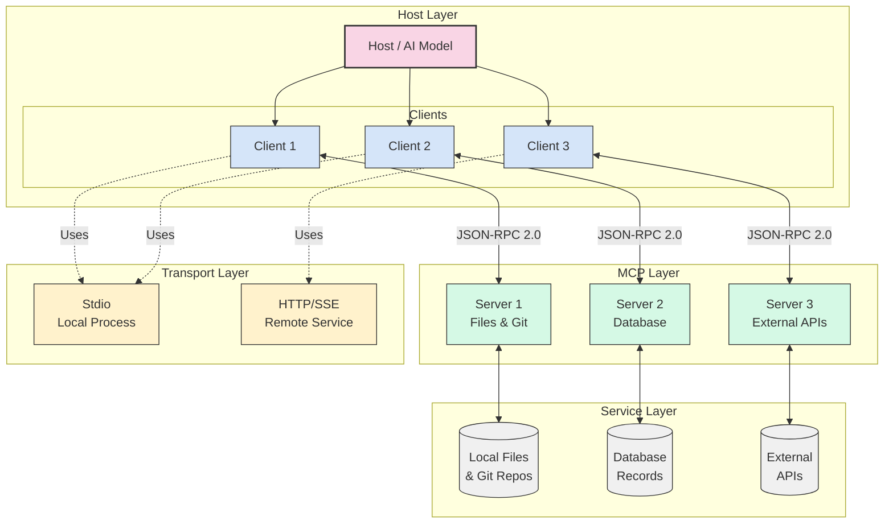
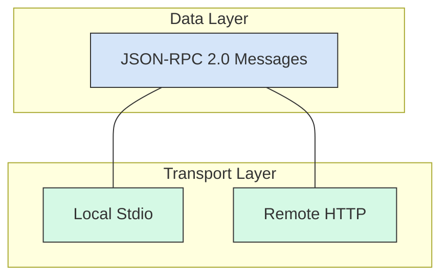
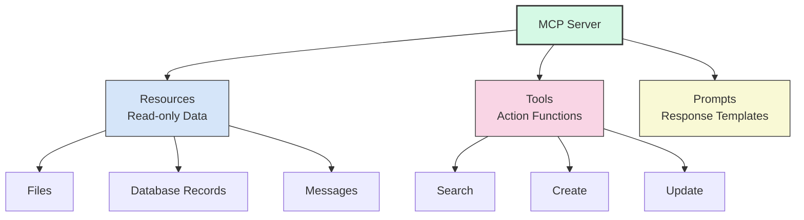
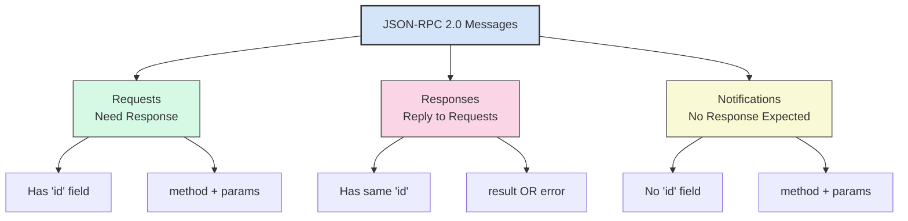
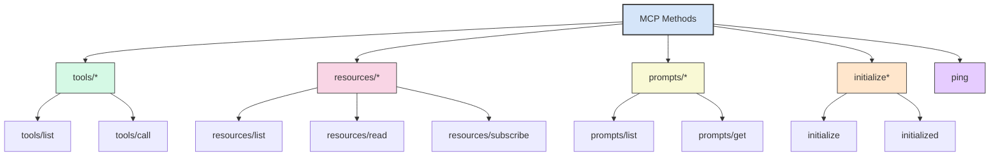
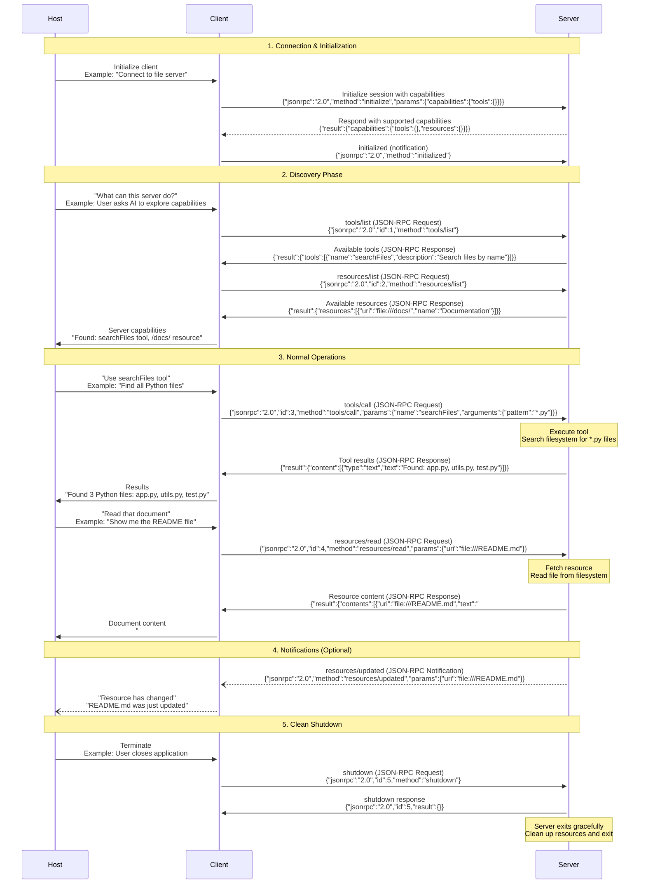
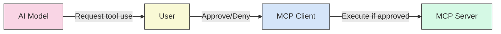

# Model Context Protocol (MCP): A Beginner's Guide

## What is MCP?

The Model Context Protocol (MCP) is an open standard that connects AI models to external data and tools. Think of MCP as a "universal translator" between AI systems and the outside world.



### The USB-C Analogy

Just like USB-C provides a single port that connects your laptop to many different devices (monitors, hard drives, chargers), MCP is a single protocol that connects AI models to many different data sources and tools. Before USB-C, we needed different ports for different devices. Similarly, before MCP, developers had to create custom integrations for each data source an AI needed to access.

## Core Architecture

MCP uses a client-host-server architecture where each host can run multiple client instances. This architecture enables integration of AI capabilities across applications while maintaining clear security boundaries.

### Participants: Who's Who in MCP

MCP has three main participants:

1. **Host**: 
- The AI application (like Claude or a coding assistant: VS Code or Cursor)
- Manages client instances (1:1 with servers), controls permissions/authorization, and coordinates AI/LLM integration with context aggregation
2. **Client**: 
- The connector that sends requests from the AI-host to servers
- Handles stateful sessions, protocol negotiation, bidirectional routing, and maintains security boundaries between servers
3. **Server**:
- The program that provides data or tools to the AI.
- Expose MCP primitives (resources, tools, prompts) independently while respecting security constraints as local or remote services



#### The Restaurant Analogy

Think of MCP as a restaurant service:
- The **Host** (AI application) is like you, the hungry customer
- The **Client** is like a waiter who takes your order and brings your food
- The **Server** is like the kitchen that prepares what you ordered
- **External Services** are like food suppliers providing ingredients to the kitchen

### Three-Tier Architecture

At a high level, MCP has three primary layers:

1. **Host Layer**: 
    Contains the AI model and user interface
2. **MCP Layer**: Clients and servers that handle requests and responses
3. **Service Layer**: External systems (GitHub, file systems, databases, etc.)



### Design Principles

MCP is built on several key design principles that shape its architecture:

1. **Simple Server Development**
   * Hosts handle complex orchestration while servers focus on specific capabilities with minimal implementation overhead

2. **High Composability**
   * Servers provide isolated functionality that can be seamlessly combined through shared protocol standards

3. **Security Isolation**
   * Servers receive only necessary context and cannot access full conversations or other servers' data

4. **Progressive Enhancement**
   * Core protocol supports minimal functionality with optional capabilities negotiated as needed

5. **Independent Evolution**
   * Servers and clients can evolve separately while maintaining backwards compatibility and extensibility

## Communication Protocol: JSON-RPC 2.0

MCP uses **JSON-RPC 2.0** as its communication protocol. Think of JSON-RPC 2.0 as the "language" that all MCP participants speak - it's simple, lightweight, and works everywhere.

### Data and Transport Layers

MCP has two communication layers:

1. **Data Layer**: Defines the message format (JSON-RPC 2.0)
2. **Transport Layer**: Handles how messages are sent



#### The Mail Analogy

MCP's layers are like sending a letter:
- The **Data Layer** is like the letter's content and format (written in English, with greeting and signature)
- The **Transport Layer** is like the delivery method (hand delivery or postal service)

## Building Blocks: The Three Primitives

MCP servers provide three types of capabilities:

1. **Resources**: Read-only data (files, emails, messages)
2. **Tools**: Functions the AI can call to perform actions
3. **Prompts**: Templates to guide the AI's responses



### The Library Analogy

MCP servers are like libraries:
- **Resources** are like books you can read but not modify
- **Tools** are like services the library offers (search catalog, reserve books)
- **Prompts** are like the reference librarian who helps you format your questions properly

### JSON-RPC 2.0 Message Types



### MCP Method Namespaces

MCP organizes its methods into logical namespaces:



## MCP in Action: Complete Interaction Flow

### Capability Negotiation & Lifecycle

MCP uses a capability-based negotiation system where clients and servers explicitly declare their supported features during initialization. The full session includes initialization, normal operations, and clean shutdown:




Each capability unlocks specific protocol features. For example:
- Tool invocation requires the server to declare tool capabilities
- Resource subscriptions require the server to declare subscription support
- Sampling requires the client to declare support in its capabilities

## Real MCP Message Examples

### 1. Tool Discovery

**Scenario**: User asks AI "What can this file server do?" and the AI needs to discover available tools.

**Request** (Client asks server for available tools):
```json
{
  "jsonrpc": "2.0",
  "id": 1,
  "method": "tools/list",
  "params": {}
}
```

**Response** (Server lists its tools):
```json
{
  "jsonrpc": "2.0",
  "id": 1,
  "result": {
    "tools": [
      {
        "name": "searchFiles",
        "description": "Search for files by name pattern in the current directory",
        "inputSchema": {
          "type": "object",
          "properties": {
            "pattern": { 
              "type": "string",
              "description": "File pattern to search for (e.g., '*.py', 'README.*')"
            },
            "directory": { 
              "type": "string",
              "description": "Directory to search in (optional, defaults to current dir)"
            }
          },
          "required": ["pattern"]
        }
      },
      {
        "name": "readFile",
        "description": "Read the contents of a specific file",
        "inputSchema": {
          "type": "object",
          "properties": {
            "path": { 
              "type": "string",
              "description": "Path to the file to read"
            }
          },
          "required": ["path"]
        }
      }
    ]
  }
}
```

### 2. Tool Execution

**Scenario**: User asks "Find all Python files in my project" and the AI uses the searchFiles tool.

**Request** (Client calls a tool):
```json
{
  "jsonrpc": "2.0",
  "id": 2,
  "method": "tools/call",
  "params": {
    "name": "searchFiles",
    "arguments": {
      "pattern": "*.py",
      "directory": "/Users/john/my-project"
    }
  }
}
```

**Response** (Server returns results):
```json
{
  "jsonrpc": "2.0",
  "id": 2,
  "result": {
    "content": [
      {
        "type": "text",
        "text": "Found 5 Python files:\n- /Users/john/my-project/app.py\n- /Users/john/my-project/utils.py\n- /Users/john/my-project/models/user.py\n- /Users/john/my-project/tests/test_app.py\n- /Users/john/my-project/scripts/setup.py"
      }
    ]
  }
}
```

### 3. Resource Reading

**Scenario**: User asks "Show me the README file" and the AI reads the resource.

**Request** (Client reads a resource):
```json
{
  "jsonrpc": "2.0",
  "id": 3,
  "method": "resources/read",
  "params": { 
    "uri": "file:///Users/john/my-project/README.md" 
  }
}
```

**Response** (Server returns resource content):
```json
{
  "jsonrpc": "2.0",
  "id": 3,
  "result": {
    "contents": [
      {
        "uri": "file:///Users/john/my-project/README.md",
        "mimeType": "text/markdown",
        "text": "# My Awesome Project\n\nThis is a sample Python project that demonstrates MCP integration.\n\n## Features\n- File searching\n- Content reading\n- Real-time updates\n\n## Installation\n```bash\npip install -r requirements.txt\n```\n\n## Usage\nRun the main application:\n```bash\npython app.py\n```"
      }
    ]
  }
}
```

### 4. Initialization Example

**Scenario**: When the AI application starts up and connects to a file server.

**Request** (Client initializes connection):
```json
{
  "jsonrpc": "2.0",
  "id": 0,
  "method": "initialize",
  "params": {
    "protocolVersion": "2024-11-05",
    "capabilities": {
      "tools": {},
      "resources": {}
    },
    "clientInfo": {
      "name": "Claude Desktop",
      "version": "1.0.0"
    }
  }
}
```

**Response** (Server responds with its capabilities):
```json
{
  "jsonrpc": "2.0",
  "id": 0,
  "result": {
    "protocolVersion": "2024-11-05",
    "capabilities": {
      "tools": {},
      "resources": {
        "subscribe": true,
        "listChanged": true
      }
    },
    "serverInfo": {
      "name": "file-server",
      "version": "1.2.0"
    }
  }
}
```

### 5. Error Handling

**Scenario**: User asks to search files but provides invalid parameters.

**Request** (Client makes invalid request):
```json
{
  "jsonrpc": "2.0",
  "id": 4,
  "method": "tools/call",
  "params": {
    "name": "searchFiles",
    "arguments": {
      "directory": "/invalid/path"
    }
  }
}
```

**Response** (Server returns error):
```json
{
  "jsonrpc": "2.0",
  "id": 4,
  "error": {
    "code": -32602,
    "message": "Invalid params",
    "data": {
      "details": "Missing required parameter: pattern"
    }
  }
}
```

### 6. Notification Example

**Scenario**: A file is modified while the AI is working, and the server notifies the client.

**Notification** (Server sends update notification):
```json
{
  "jsonrpc": "2.0",
  "method": "resources/updated",
  "params": {
    "uri": "file:///Users/john/my-project/README.md"
  }
}
```

*Note: Notifications don't have an `id` field because they don't expect a response.*

### Protocol Benefits

Using JSON-RPC 2.0 gives MCP several advantages:

1. **Discoverability**: Clients can ask "what can you do?" (`tools/list`, `resources/list`)
2. **Type Safety**: JSON schemas define expected input/output
3. **Error Handling**: Standardized error responses
4. **Extensibility**: Easy to add new methods without breaking compatibility
5. **Debugging**: Human-readable messages for easy troubleshooting

## Security and User Control

MCP is designed with security in mind:

1. Tool execution typically requires user approval
2. Servers can implement authentication (OAuth, API keys)
3. Hosts can limit which servers they connect to
4. Servers only receive necessary contextual information
5. Cross-server interactions are controlled by the host



## Real-World Impact

MCP is rapidly gaining adoption across the AI industry:

- Major platforms like AWS, GitHub, and OpenAI support it
- Hundreds of open-source MCP servers exist for various services
- Developer tools (Zed, Replit) are integrating MCP
- Research is ongoing to improve security and capabilities

## Getting Started with MCP

If you're interested in working with MCP:

1. **For users**: Look for AI applications that support MCP connections
2. **For developers**: Consider building MCP servers for your data sources
3. **For researchers**: Explore security implications and protocol extensions

## Conclusion

MCP represents a significant step forward in making AI more useful and connected. By providing a standardized way for AI models to interact with external data and tools, MCP enables more capable, flexible, and personalized AI applications while maintaining user control.

Just as web standards like HTTP and REST enabled the explosive growth of web applications, MCP is positioned to drive the next wave of AI innovation by breaking down the walls between AI models and the wider digital world.

## References

### Official Documentation
1. [Introduction - Model Context Protocol](https://modelcontextprotocol.io/docs/getting-started/intro)
2. [Architecture Overview - Model Context Protocol](https://modelcontextprotocol.io/docs/learn/architecture)
3. [Server Concepts - Model Context Protocol](https://modelcontextprotocol.io/docs/learn/server-concepts)
4. [Client Implementation - Model Context Protocol](https://modelcontextprotocol.io/docs/learn/client-implementation)
5. [MCP Specification - Model Context Protocol](https://modelcontextprotocol.io/specification/2025-06-18/overview)

### Official Announcements
6. [Introducing the Model Context Protocol \ Anthropic](https://www.anthropic.com/news/model-context-protocol)
7. [Model Context Protocol - Overview](http://modelcontextprotocol.io/overview)

### Research Papers
8. [Model Context Protocol (MCP): Landscape, Security Threats, and Future Research Directions](https://arxiv.org/abs/2503.23278)
9. [Model Context Protocol (MCP) at First Glance: Studying the Security and Maintainability of MCP Servers](https://arxiv.org/abs/2506.13538)