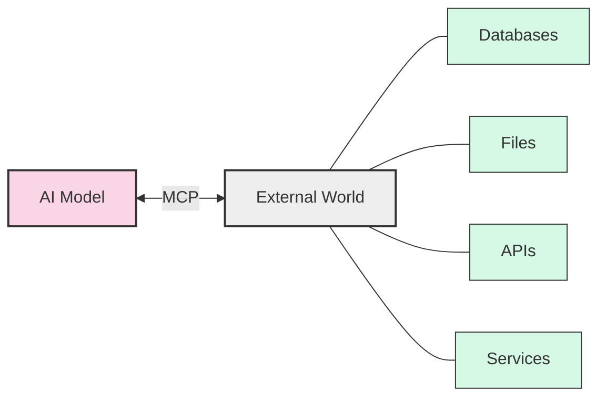
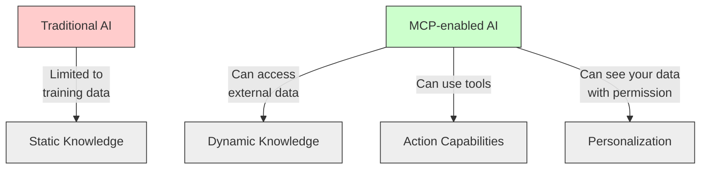
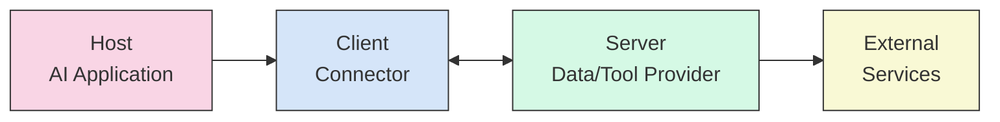
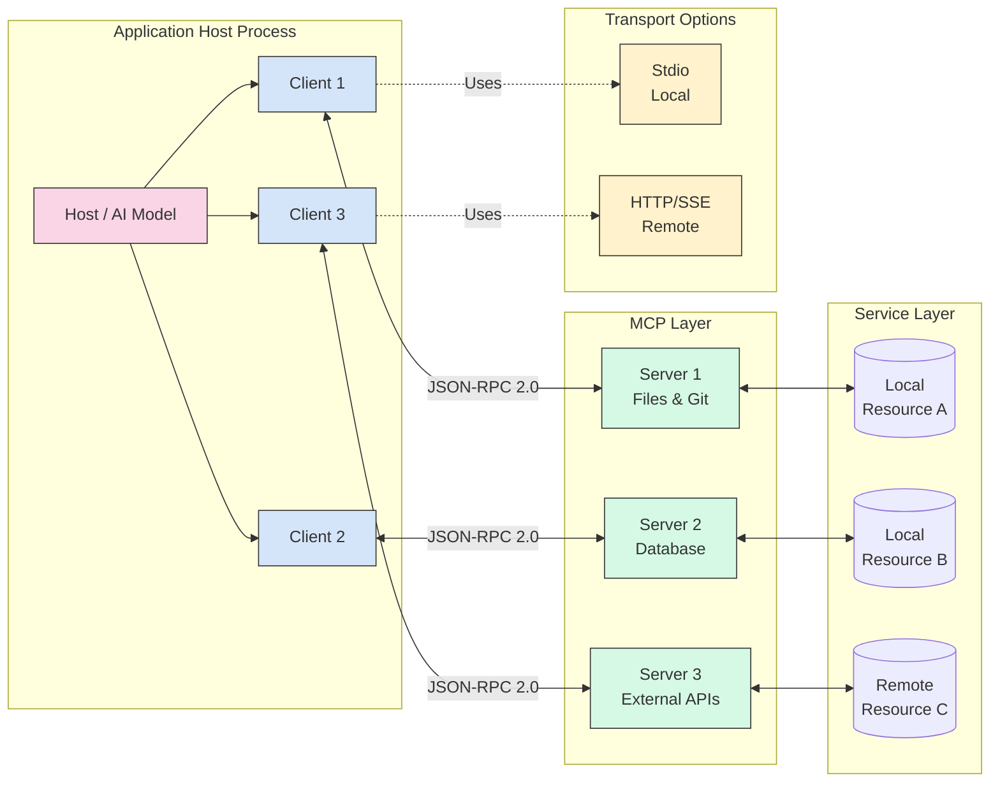
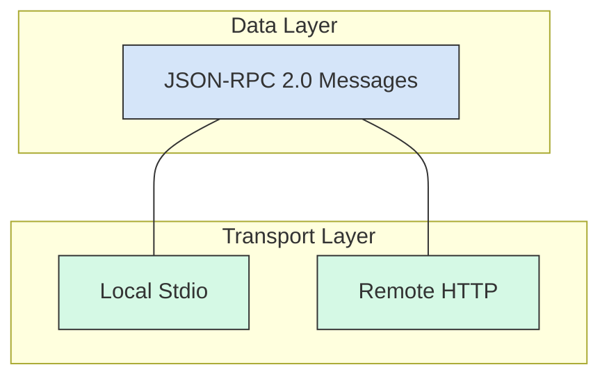
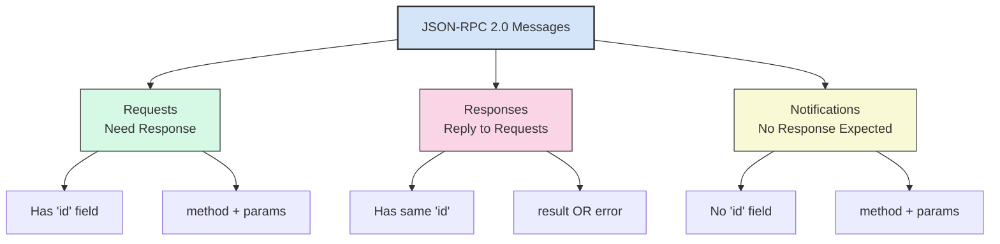
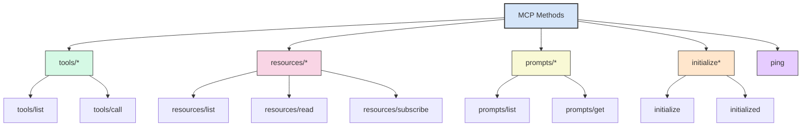
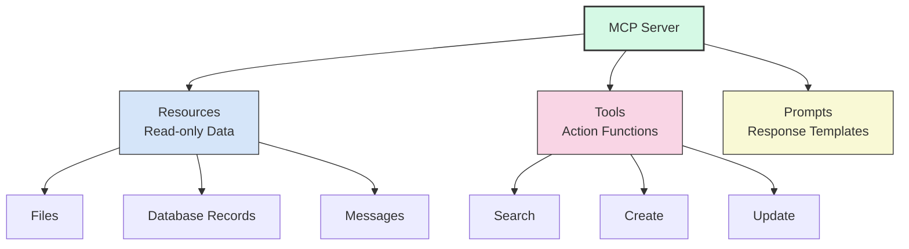
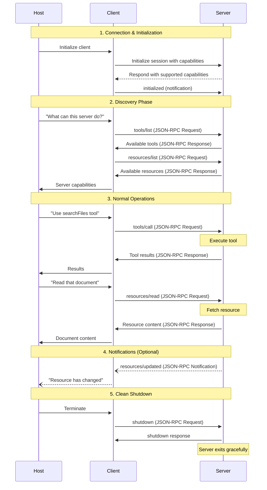
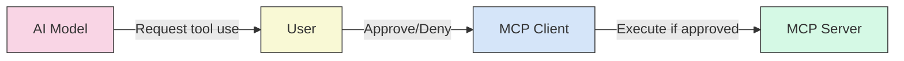

# Model Context Protocol (MCP): A Beginner's Guide

## What is MCP?

The Model Context Protocol (MCP) is an open standard that connects AI models to external data and tools. Think of MCP as a "universal translator" between AI systems and the outside world.



### The USB-C Analogy

Just like USB-C provides a single port that connects your laptop to many different devices (monitors, hard drives, chargers), MCP is a single protocol that connects AI models to many different data sources and tools. Before USB-C, we needed different ports for different devices. Similarly, before MCP, developers had to create custom integrations for each data source an AI needed to access.

## Why MCP Matters

Traditional AI models are limited to the data they were trained on. They're like experts locked in soundproof rooms - knowledgeable but isolated. MCP breaks down these walls, allowing AI to:

1. Access real-time information
2. Use specialized tools
3. Interact with your personal data (with permission)



## Core Architecture

MCP uses a client-host-server architecture where each host can run multiple client instances. This architecture enables integration of AI capabilities across applications while maintaining clear security boundaries.

### Participants: Who's Who in MCP

MCP has three main participants:

1. **Host**: The AI application (like Claude or a coding assistant)
2. **Client**: The connector that sends requests from the host to servers
3. **Server**: The program that provides data or tools to the AI



#### The Restaurant Analogy

Think of MCP as a restaurant service:
- The **Host** (AI application) is like you, the hungry customer
- The **Client** is like a waiter who takes your order and brings your food
- The **Server** is like the kitchen that prepares what you ordered
- **External Services** are like food suppliers providing ingredients to the kitchen

### Three-Tier Architecture

At a high level, MCP has three primary layers:

1. **Host Layer**: Contains the AI model and user interface
2. **MCP Layer**: Clients and servers that handle requests and responses
3. **Service Layer**: External systems (GitHub, file systems, databases, etc.)



### Core Components in Detail

#### Host

The host process acts as the container and coordinator:

* Creates and manages multiple client instances
* Controls client connection permissions and lifecycle
* Enforces security policies and consent requirements
* Handles user authorization decisions
* Coordinates AI/LLM integration
* Manages context aggregation across clients

#### Clients

Each client is created by the host and maintains an isolated server connection:

* Establishes one stateful session per server
* Handles protocol negotiation and capability exchange
* Routes protocol messages bidirectionally
* Manages subscriptions and notifications
* Maintains security boundaries between servers

A host application creates and manages multiple clients, with each client having a 1:1 relationship with a particular server.

#### Servers

Servers provide specialized context and capabilities:

* Expose resources, tools and prompts via MCP primitives
* Operate independently with focused responsibilities
* Request sampling through client interfaces
* Must respect security constraints
* Can be local processes or remote services

### Design Principles

MCP is built on several key design principles that shape its architecture:

1. **Servers should be extremely easy to build**
   * Host applications handle complex orchestration responsibilities
   * Servers focus on specific, well-defined capabilities
   * Simple interfaces minimize implementation overhead
   * Clear separation enables maintainable code

2. **Servers should be highly composable**
   * Each server provides focused functionality in isolation
   * Multiple servers can be combined seamlessly
   * Shared protocol enables interoperability
   * Modular design supports extensibility

3. **Servers should not be able to read the whole conversation, nor "see into" other servers**
   * Servers receive only necessary contextual information
   * Full conversation history stays with the host
   * Each server connection maintains isolation
   * Cross-server interactions are controlled by the host
   * Host process enforces security boundaries

4. **Features can be added to servers and clients progressively**
   * Core protocol provides minimal required functionality
   * Additional capabilities can be negotiated as needed
   * Servers and clients evolve independently
   * Protocol designed for future extensibility
   * Backwards compatibility is maintained

## Communication Protocol: JSON-RPC 2.0

MCP uses **JSON-RPC 2.0** as its communication protocol. Think of JSON-RPC 2.0 as the "language" that all MCP participants speak - it's simple, lightweight, and works everywhere.

### Data and Transport Layers

MCP has two communication layers:

1. **Data Layer**: Defines the message format (JSON-RPC 2.0)
2. **Transport Layer**: Handles how messages are sent



#### The Mail Analogy

MCP's layers are like sending a letter:
- The **Data Layer** is like the letter's content and format (written in English, with greeting and signature)
- The **Transport Layer** is like the delivery method (hand delivery or postal service)

### JSON-RPC 2.0 Message Types



### MCP Method Namespaces

MCP organizes its methods into logical namespaces:



## Building Blocks: The Three Primitives

MCP servers provide three types of capabilities:

1. **Resources**: Read-only data (files, emails, messages)
2. **Tools**: Functions the AI can call to perform actions
3. **Prompts**: Templates to guide the AI's responses



### The Library Analogy

MCP servers are like libraries:
- **Resources** are like books you can read but not modify
- **Tools** are like services the library offers (search catalog, reserve books)
- **Prompts** are like the reference librarian who helps you format your questions properly

## MCP in Action: Complete Interaction Flow

### Capability Negotiation & Lifecycle

MCP uses a capability-based negotiation system where clients and servers explicitly declare their supported features during initialization. The full session includes initialization, normal operations, and clean shutdown:



Each capability unlocks specific protocol features. For example:
- Tool invocation requires the server to declare tool capabilities
- Resource subscriptions require the server to declare subscription support
- Sampling requires the client to declare support in its capabilities

## Real MCP Message Examples

### 1. Tool Discovery

**Request** (Client asks server for available tools):
```json
{
  "jsonrpc": "2.0",
  "id": 1,
  "method": "tools/list",
  "params": {}
}
```

**Response** (Server lists its tools):
```json
{
  "jsonrpc": "2.0",
  "id": 1,
  "result": {
    "tools": [
      {
        "name": "searchFlights",
        "description": "Find flights between two airports",
        "inputSchema": {
          "type": "object",
          "properties": {
            "origin": { "type": "string" },
            "destination": { "type": "string" },
            "date": { "type": "string", "format": "date" }
          },
          "required": ["origin", "destination", "date"]
        }
      }
    ]
  }
}
```

### 2. Tool Execution

**Request** (Client calls a tool):
```json
{
  "jsonrpc": "2.0",
  "id": 2,
  "method": "tools/call",
  "params": {
    "name": "searchFlights",
    "arguments": {
      "origin": "SFO",
      "destination": "LAX",
      "date": "2025-09-10"
    }
  }
}
```

**Response** (Server returns results):
```json
{
  "jsonrpc": "2.0",
  "id": 2,
  "result": {
    "content": [
      {
        "type": "text",
        "text": "Found 3 flights:\n- UA123 at 08:00 ($120)\n- DL456 at 09:15 ($135)\n- AA789 at 10:30 ($115)"
      }
    ]
  }
}
```

### 3. Resource Reading

**Request** (Client reads a resource):
```json
{
  "jsonrpc": "2.0",
  "id": 3,
  "method": "resources/read",
  "params": { 
    "uri": "file:///Documents/report.txt" 
  }
}
```

**Response** (Server returns resource content):
```json
{
  "jsonrpc": "2.0",
  "id": 3,
  "result": {
    "contents": [
      {
        "uri": "file:///Documents/report.txt",
        "mimeType": "text/plain",
        "text": "Q3 Financial Report\n==================\nRevenue increased by 15%..."
      }
    ]
  }
}
```

### 4. Error Handling

When something goes wrong, servers return error responses:

```json
{
  "jsonrpc": "2.0",
  "id": 2,
  "error": {
    "code": -32602,
    "message": "Invalid params",
    "data": {
      "details": "Missing required parameter: origin"
    }
  }
}
```

### Protocol Benefits

Using JSON-RPC 2.0 gives MCP several advantages:

1. **Discoverability**: Clients can ask "what can you do?" (`tools/list`, `resources/list`)
2. **Type Safety**: JSON schemas define expected input/output
3. **Error Handling**: Standardized error responses
4. **Extensibility**: Easy to add new methods without breaking compatibility
5. **Debugging**: Human-readable messages for easy troubleshooting

## Security and User Control

MCP is designed with security in mind:

1. Tool execution typically requires user approval
2. Servers can implement authentication (OAuth, API keys)
3. Hosts can limit which servers they connect to
4. Servers only receive necessary contextual information
5. Cross-server interactions are controlled by the host



## Real-World Impact

MCP is rapidly gaining adoption across the AI industry:

- Major platforms like AWS, GitHub, and OpenAI support it
- Hundreds of open-source MCP servers exist for various services
- Developer tools (Zed, Replit) are integrating MCP
- Research is ongoing to improve security and capabilities

## Getting Started with MCP

If you're interested in working with MCP:

1. **For users**: Look for AI applications that support MCP connections
2. **For developers**: Consider building MCP servers for your data sources
3. **For researchers**: Explore security implications and protocol extensions

## Conclusion

MCP represents a significant step forward in making AI more useful and connected. By providing a standardized way for AI models to interact with external data and tools, MCP enables more capable, flexible, and personalized AI applications while maintaining user control.

Just as web standards like HTTP and REST enabled the explosive growth of web applications, MCP is positioned to drive the next wave of AI innovation by breaking down the walls between AI models and the wider digital world.

## References

### Official Documentation
1. [Introduction - Model Context Protocol](https://modelcontextprotocol.io/docs/getting-started/intro)
2. [Architecture Overview - Model Context Protocol](https://modelcontextprotocol.io/docs/learn/architecture)
3. [Server Concepts - Model Context Protocol](https://modelcontextprotocol.io/docs/learn/server-concepts)
4. [Client Implementation - Model Context Protocol](https://modelcontextprotocol.io/docs/learn/client-implementation)
5. [MCP Specification - Model Context Protocol](https://modelcontextprotocol.io/specification/2025-06-18/overview)

### Official Announcements
6. [Introducing the Model Context Protocol \ Anthropic](https://www.anthropic.com/news/model-context-protocol)
7. [Model Context Protocol - Overview](http://modelcontextprotocol.io/overview)

### Research Papers
8. [Model Context Protocol (MCP): Landscape, Security Threats, and Future Research Directions](https://arxiv.org/abs/2503.23278)
9. [Model Context Protocol (MCP) at First Glance: Studying the Security and Maintainability of MCP Servers](https://arxiv.org/abs/2506.13538)