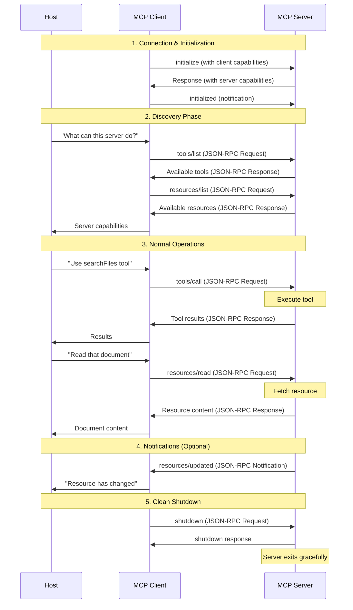

# Model Context Protocol (MCP): A Beginner's Guide

## What is MCP?

The Model Context Protocol (MCP) is an open standard that connects AI models to external data and tools. Think of MCP as a "universal translator" between AI systems and the outside world.


### The USB-C Analogy

Just like USB-C provides a single port that connects your laptop to many different devices (monitors, hard drives, chargers), MCP is a single protocol that connects AI models to many different data sources and tools. Before USB-C, we needed different ports for different devices. Similarly, before MCP, developers had to create custom integrations for each data source an AI needed to access.

## Why MCP Matters

Traditional AI models are limited to the data they were trained on. They're like experts locked in soundproof rooms - knowledgeable but isolated. MCP breaks down these walls, allowing AI to:

1. Access real-time information
2. Use specialized tools
3. Interact with your personal data (with permission)


## Core Participants: Who's Who in MCP

MCP has three main participants:

1. **Host**: The AI application (like Claude or a coding assistant)
2. **Client**: The connector that sends requests from the host to servers
3. **Server**: The program that provides data or tools to the AI


### The Restaurant Analogy

Think of MCP as a restaurant service:
- The **Host** (AI application) is like you, the hungry customer
- The **Client** is like a waiter who takes your order and brings your food
- The **Server** is like the kitchen that prepares what you ordered
- **External Services** are like food suppliers providing ingredients to the kitchen

## MCP Architecture: How It All Fits Together

MCP uses a three-tier architecture:

1. **Host Layer**: Contains the AI model and user interface
2. **MCP Layer**: Clients and servers that handle requests and responses
3. **Service Layer**: External systems (GitHub, file systems, databases, etc.)


## Communication in MCP: JSON-RPC 2.0

MCP uses **JSON-RPC 2.0** as its communication protocol. Think of JSON-RPC 2.0 as the "language" that all MCP participants speak - it's simple, lightweight, and works everywhere.

### Why JSON-RPC 2.0?

MCP chose JSON-RPC 2.0 because it's:
- **Transport-agnostic**: Works over stdio, HTTP, WebSocket, etc.
- **Stateless and lightweight**: No complex state management
- **Human-readable**: Easy to debug and understand
- **Language-agnostic**: Works with any programming language
- **Standardized**: Based on an existing, proven specification

### JSON-RPC 2.0 Message Types


### MCP Method Namespaces

MCP organizes its methods into logical namespaces:


### Data and Transport Layers

MCP has two layers:

1. **Data Layer**: Defines the message format (JSON-RPC 2.0)
2. **Transport Layer**: Handles how messages are sent


#### The Mail Analogy

MCP's layers are like sending a letter:
- The **Data Layer** is like the letter's content and format (written in English, with greeting and signature)
- The **Transport Layer** is like the delivery method (hand delivery or postal service)

## Building Blocks: The Three Primitives

MCP servers provide three types of capabilities:

1. **Resources**: Read-only data (files, emails, messages)
2. **Tools**: Functions the AI can call to perform actions
3. **Prompts**: Templates to guide the AI's responses


### The Library Analogy

MCP servers are like libraries:
- **Resources** are like books you can read but not modify
- **Tools** are like services the library offers (search catalog, reserve books)
- **Prompts** are like the reference librarian who helps you format your questions properly

## Complete MCP Interaction Flow

Here's how a complete MCP session works from connection to shutdown using JSON-RPC 2.0:



### Connection Lifecycle

The complete MCP interaction flow shown above includes these key phases:

1. **Initialization**: Client and server exchange capabilities during handshake
2. **Discovery**: Client learns what tools and resources are available
3. **Normal Operations**: Tools are called, resources are read, notifications sent
4. **Shutdown**: Clean termination when the session ends

This standardized lifecycle ensures reliable communication and proper resource management.

## Real MCP Message Examples

### 1. Tool Discovery

**Request** (Client asks server for available tools):
```json
{
  "jsonrpc": "2.0",
  "id": 1,
  "method": "tools/list",
  "params": {}
}
```

**Response** (Server lists its tools):
```json
{
  "jsonrpc": "2.0",
  "id": 1,
  "result": {
    "tools": [
      {
        "name": "searchFlights",
        "description": "Find flights between two airports",
        "inputSchema": {
          "type": "object",
          "properties": {
            "origin": { "type": "string" },
            "destination": { "type": "string" },
            "date": { "type": "string", "format": "date" }
          },
          "required": ["origin", "destination", "date"]
        }
      }
    ]
  }
}
```

### 2. Tool Execution

**Request** (Client calls a tool):
```json
{
  "jsonrpc": "2.0",
  "id": 2,
  "method": "tools/call",
  "params": {
    "name": "searchFlights",
    "arguments": {
      "origin": "SFO",
      "destination": "LAX",
      "date": "2025-09-10"
    }
  }
}
```

**Response** (Server returns results):
```json
{
  "jsonrpc": "2.0",
  "id": 2,
  "result": {
    "content": [
      {
        "type": "text",
        "text": "Found 3 flights:\n- UA123 at 08:00 ($120)\n- DL456 at 09:15 ($135)\n- AA789 at 10:30 ($115)"
      }
    ]
  }
}
```

### 3. Resource Reading

**Request** (Client reads a resource):
```json
{
  "jsonrpc": "2.0",
  "id": 3,
  "method": "resources/read",
  "params": { 
    "uri": "file:///Documents/report.txt" 
  }
}
```

**Response** (Server returns resource content):
```json
{
  "jsonrpc": "2.0",
  "id": 3,
  "result": {
    "contents": [
      {
        "uri": "file:///Documents/report.txt",
        "mimeType": "text/plain",
        "text": "Q3 Financial Report\n==================\nRevenue increased by 15%..."
      }
    ]
  }
}
```

### 4. Error Handling

When something goes wrong, servers return error responses:

```json
{
  "jsonrpc": "2.0",
  "id": 2,
  "error": {
    "code": -32602,
    "message": "Invalid params",
    "data": {
      "details": "Missing required parameter: origin"
    }
  }
}
```

### The Protocol Benefits

Using JSON-RPC 2.0 gives MCP several advantages:

1. **Discoverability**: Clients can ask "what can you do?" (`tools/list`, `resources/list`)
2. **Type Safety**: JSON schemas define expected input/output
3. **Error Handling**: Standardized error responses
4. **Extensibility**: Easy to add new methods without breaking compatibility
5. **Debugging**: Human-readable messages for easy troubleshooting

This structured approach makes MCP both powerful and accessible - developers can quickly understand what any MCP server offers and how to use it.

## Security and User Control

MCP is designed with security in mind:

1. Tool execution typically requires user approval
2. Servers can implement authentication (OAuth, API keys)
3. Hosts can limit which servers they connect to


## Real-World Impact

MCP is rapidly gaining adoption across the AI industry:

- Major platforms like AWS, GitHub, and OpenAI support it
- Hundreds of open-source MCP servers exist for various services
- Developer tools (Zed, Replit) are integrating MCP
- Research is ongoing to improve security and capabilities

## Getting Started with MCP

If you're interested in working with MCP:

1. **For users**: Look for AI applications that support MCP connections
2. **For developers**: Consider building MCP servers for your data sources
3. **For researchers**: Explore security implications and protocol extensions

## Conclusion

MCP represents a significant step forward in making AI more useful and connected. By providing a standardized way for AI models to interact with external data and tools, MCP enables more capable, flexible, and personalized AI applications while maintaining user control.

Just as web standards like HTTP and REST enabled the explosive growth of web applications, MCP is positioned to drive the next wave of AI innovation by breaking down the walls between AI models and the wider digital world.

## References

1. [Introduction - Model Context Protocol](https://modelcontextprotocol.io/docs/getting-started/intro)
2. [Architecture Overview - Model Context Protocol](https://modelcontextprotocol.io/docs/learn/architecture)
3. [Introducing the Model Context Protocol \ Anthropic](https://www.anthropic.com/news/model-context-protocol)
4. [Understanding the Model Context Protocol (MCP) | deepset Blog](https://www.deepset.ai/blog/understanding-the-model-context-protocol-mcp)
5. [The Architectural Elegance of Model Context Protocol (MCP) - The ML Architect](https://themlarchitect.com/blog/the-architectural-elegance-of-model-context-protocol-mcp/)
6. [Server Concepts - Model Context Protocol](https://modelcontextprotocol.io/docs/learn/server-concepts)
7. [Model Context Protocol - Model Context Protocol](http://modelcontextprotocol.io/overview)
8. [Model Context Protocol (MCP): Landscape, Security Threats, and Future Research Directions](https://arxiv.org/abs/2503.23278)
9. [Model Context Protocol (MCP) at First Glance: Studying the Security and Maintainability of MCP Servers](https://arxiv.org/abs/2506.13538)