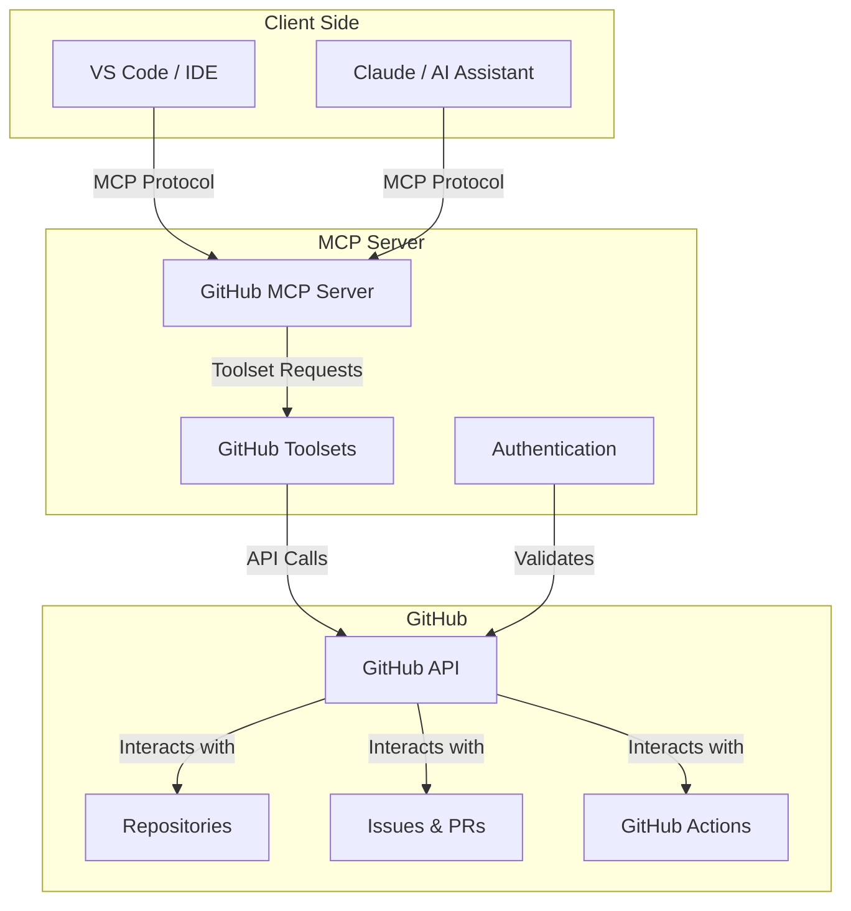
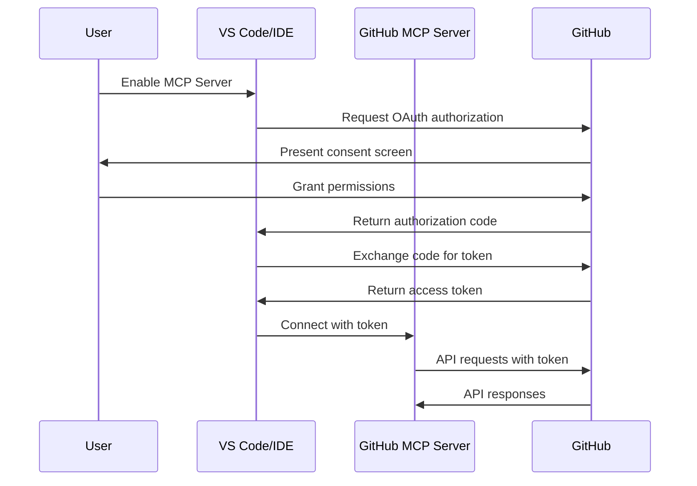
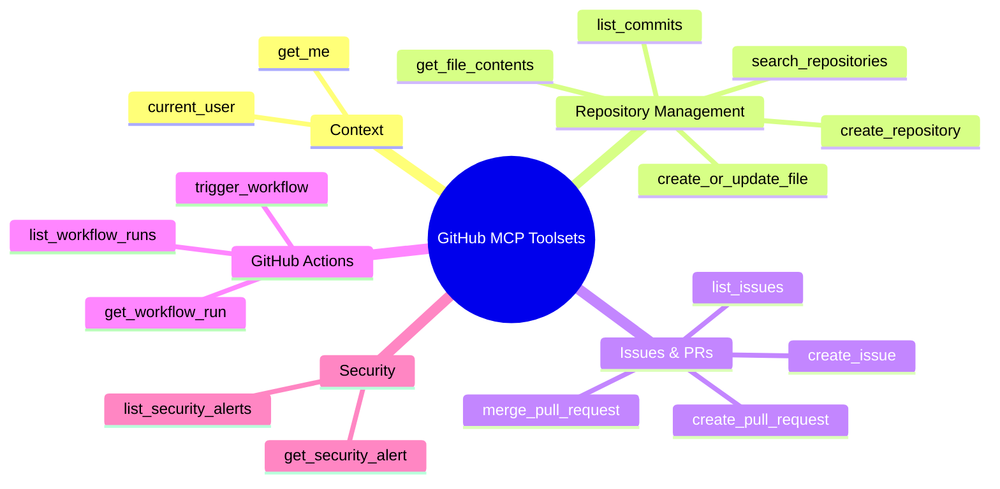
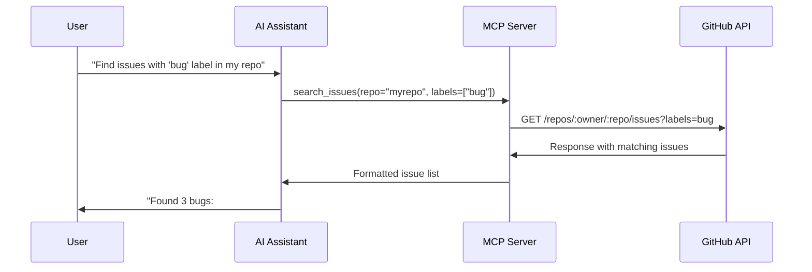

# GitHub MCP Server: Beginner's Guide

This guide provides a comprehensive overview of GitHub MCP Server, its implementation, and how to use it effectively in your development workflow.

## Table of Contents
- [What is GitHub MCP Server?](#what-is-github-mcp-server)
- [Architecture Overview](#architecture-overview)
- [Installation & Setup](#installation--setup)
- [Authentication Methods](#authentication-methods)
- [Available Tools & Actions](#available-tools--actions)
- [Code Structure & Implementation](#code-structure--implementation)
- [VS Code Integration](#vs-code-integration)
- [Docker Implementation](#docker-implementation)
- [Working with GitHub MCP Server](#working-with-github-mcp-server)
- [Future Scope & Development](#future-scope--development)
- [Troubleshooting](#troubleshooting)

## What is GitHub MCP Server?

GitHub MCP Server is GitHub's official implementation of the Model Context Protocol (MCP), designed to bridge AI tools with GitHub's ecosystem through natural language interactions. It allows AI assistants like GitHub Copilot to directly interact with GitHub repositories, issues, pull requests, and more.

Key benefits:
- Execute GitHub operations via natural language
- Automate complex multi-step workflows
- Leverage GitHub data for context-aware code analysis
- Integrate with CI/CD pipelines through conversational interfaces

## Architecture Overview

The GitHub MCP Server follows a client-server architecture based on the Model Context Protocol:



The server exposes GitHub functionality through standardized tool interfaces, supporting both local and remote transport protocols:
- **Local**: Standard input/output (stdio) for local process communication
- **Remote**: HTTP/SSE and Streamable HTTP for remote deployments

## Installation & Setup

### Prerequisites
- Git installed
- GitHub account
- VS Code (version 1.101+) for optimal experience
- Docker (for containerized usage)

### Basic Setup

1. Clone the repository:
```bash
git clone https://github.com/github/github-mcp-server.git
cd github-mcp-server
```

2. Set up authentication (see [Authentication Methods](#authentication-methods) below)

3. Configure your MCP client (like VS Code) to use the server

## Authentication Methods

GitHub MCP Server supports two primary authentication methods:

### OAuth 2.1 Authentication (Recommended)



**Setup:**
```json
{
  "servers": {
    "github": {
      "type": "http",
      "url": "https://api.githubcopilot.com/mcp/"
    }
  }
}
```

### Personal Access Token (PAT) Authentication

Create a GitHub Personal Access Token with appropriate scopes and configure:

```json
{
  "servers": {
    "github": {
      "type": "http",
      "url": "https://api.githubcopilot.com/mcp/",
      "headers": {
        "Authorization": "Bearer ${input:github_mcp_pat}"
      }
    }
  }
}
```

> **Security Note**: Store tokens securely, use environment variables, implement token rotation policies, and use minimal required scopes.

## Available Tools & Actions

GitHub MCP Server organizes functionality into distinct toolsets:



### Essential Toolsets

1. **Context Toolset**
   - Retrieve current user information
   - Provide authentication and user context
   
2. **Repository Management**
   - Browse and query code across repositories
   - Search files and analyze commit history
   - Create and update files

3. **Issues & Pull Requests**
   - Create and manage issues programmatically
   - Review and merge pull requests
   - Implement automated workflows

4. **GitHub Actions**
   - Monitor workflow runs
   - Trigger deployments and manage releases
   - Access detailed job logs

## Code Structure & Implementation

GitHub MCP Server is written primarily in Go (99.0% of codebase), offering excellent performance, reliability, and scalability. Let's explore the core structure of the repository and understand key components.

### Repository Structure

```
github-mcp-server/
├── cmd/                   # Command-line applications
│   └── github-mcp-server/ # Main entry point
├── internal/              # Private application code
│   ├── ghmcp/             # Core server implementation
│   └── toolsnaps/         # Tool snapshot tests
├── pkg/                   # Public library code
│   ├── github/            # GitHub API integration
│   └── toolsets/          # Toolset implementations
├── docs/                  # Documentation
├── e2e/                   # End-to-end tests
└── script/               # Build automation scripts
```

### Core Code Examples

#### Main Entry Point

```go
// cmd/github-mcp-server/main.go
package main

import (
    "github.com/github/github-mcp-server/internal/ghmcp"
    "github.com/github/github-mcp-server/pkg/github"
    "github.com/spf13/cobra"
    "github.com/spf13/viper"
)

var (
    rootCmd = &cobra.Command{
        Use:   "server",
        Short: "GitHub MCP Server",
        Long:  `A GitHub MCP server that handles various tools and resources`,
    }
    
    stdioCmd = &cobra.Command{
        Use:   "stdio",
        Short: "Start stdio server",
        RunE: func(_ *cobra.Command, _ []string) error {
            // Server initialization logic
        },
    }
)
```

#### Tool Implementation Pattern

Tools are implemented following a consistent pattern:

```go
// Example of tool implementation
func NewCustomTool(getClient GetClientFn, t translations.TranslationHelperFunc) server.ServerTool {
    return toolsets.NewServerTool(
        mcp.NewTool("custom_repository_operation",
            mcp.WithDescription(t("TOOL_CUSTOM_DESCRIPTION")),
            mcp.WithString("owner", mcp.Required(), mcp.Description("Repository owner")),
            mcp.WithString("repo", mcp.Required(), mcp.Description("Repository name")),
            mcp.WithBoolean("readOnlyHint", true),
        ),
        func(ctx context.Context, request mcp.CallToolRequest) (*mcp.CallToolResult, error) {
            // Parameter validation
            owner, err := github.RequiredParam[string](request, "owner")
            if err != nil {
                return mcp.NewToolResultError("missing owner parameter", err), nil
            }
            
            // Custom implementation logic here
            
            return github.MarshalledTextResult(result), nil
        },
    )
}
```

### Toolset Management System

The toolset system represents one of the most sophisticated aspects of the codebase:

```go
// Dynamic toolset loading
func InitDynamicToolset(s *server.MCPServer, tsg *toolsets.ToolsetGroup, t translations.TranslationHelperFunc) *toolsets.Toolset {
    dynamicToolSelection := toolsets.NewToolset("dynamic", "Discover GitHub MCP tools").
        AddReadTools(
            toolsets.NewServerTool(ListAvailableToolsets(tsg, t)),
            toolsets.NewServerTool(EnableToolset(s, tsg, t)),
        )
    
    dynamicToolSelection.Enabled = true
    return dynamicToolSelection
}
```

### Docker Implementation

The project uses a multi-stage Dockerfile for efficient builds:

```dockerfile
FROM golang:1.24.4-alpine AS build
ARG VERSION="dev"
WORKDIR /build
RUN --mount=type=cache,target=/var/cache/apk \
    apk add git
RUN --mount=type=cache,target=/go/pkg/mod \
    --mount=type=cache,target=/root/.cache/go-build \
    --mount=type=bind,target=. \
    CGO_ENABLED=0 go build -ldflags="-s -w -X main.version=${VERSION}" \
    -o /bin/github-mcp-server cmd/github-mcp-server/main.go

FROM gcr.io/distroless/base-debian12
WORKDIR /server
COPY --from=build /bin/github-mcp-server .
ENTRYPOINT ["/server/github-mcp-server"]
CMD ["stdio"]
```

### Authentication Implementation

The server supports multiple authentication mechanisms:

```go
// Bearer token authentication transport
type bearerAuthTransport struct {
    transport http.RoundTripper
    token     string
}

func (t *bearerAuthTransport) RoundTrip(req *http.Request) (*http.Response, error) {
    req = req.Clone(req.Context())
    req.Header.Set("Authorization", "Bearer "+t.token)
    return t.transport.RoundTrip(req)
}
```

## VS Code Integration

VS Code provides seamless integration with GitHub MCP Server:

### One-Click Installation (Recommended)

1. Navigate to GitHub MCP Server repository
2. Click "Add to VS Code" button
3. Complete the OAuth flow
4. Enable Agent mode in Copilot Chat

### Manual Configuration

1. Create `.vscode/mcp.json` in your project root:
```json
{
  "servers": {
    "github": {
      "type": "http",
      "url": "https://api.githubcopilot.com/mcp/",
      "toolsets": ["repos", "issues", "pull_requests"]
    }
  }
}
```

2. Enable Agent Mode:
   - Open Copilot Chat (Ctrl+Alt+I)
   - Select "Agent" from dropdown
   - Click Tools button to view available actions

## Docker Implementation

GitHub MCP Server can be easily deployed using Docker:

### Local Docker Setup

```json
{
  "mcp": {
    "servers": {
      "github": {
        "command": "docker",
        "args": [
          "run", "-i", "--rm",
          "-e", "GITHUB_PERSONAL_ACCESS_TOKEN",
          "ghcr.io/github/github-mcp-server"
        ],
        "env": {
          "GITHUB_PERSONAL_ACCESS_TOKEN": "${input:github_token}"
        }
      }
    }
  }
}
```

### Docker Compose for Production

Create a `docker-compose.yml` file:

```yaml
version: '3.8'
services:
  github-mcp-server:
    image: ghcr.io/github/github-mcp-server:latest
    environment:
      - GITHUB_PERSONAL_ACCESS_TOKEN=${GITHUB_TOKEN}
      - GITHUB_TOOLSETS=repos,issues,pull_requests,actions
      - GITHUB_READ_ONLY=0
    volumes:
      - ./config:/app/config
    restart: unless-stopped
    ports:
      - "8080:8080"
```

Run with:

```bash
docker-compose up -d
```

## Working with GitHub MCP Server

### Example: Interacting with Repositories



### Using from VS Code

1. Open VS Code with Copilot Chat enabled
2. Ensure MCP Server is configured
3. Open Copilot Chat (Ctrl+Alt+I)
4. Select "Agent" from dropdown
5. Enter natural language queries like:
   - "List open issues in this repository"
   - "Create a new branch called 'feature/user-auth'"
   - "Show me recent commits to this file"

### Using with Local Docker

1. Start the MCP Server container:
```bash
docker run -i --rm -e GITHUB_PERSONAL_ACCESS_TOKEN=your_token ghcr.io/github/github-mcp-server
```

2. Configure your MCP client to connect to the local server
3. Use as you would with the remote server

## Future Scope & Development

GitHub MCP Server is continuously evolving with planned enhancements:

- **Enhanced OAuth 2.1 Implementation**: Improved security and token management
- **Streamable HTTP Transport**: Better scalability and performance
- **Dynamic Client Registration**: Simplified server discovery and configuration
- **Expanded Toolsets**: Additional GitHub functionality and integrations

Community trends suggest growing adoption across enterprises and increased integration with cloud providers and AI frameworks.

## Troubleshooting

### Authentication Problems

- **OAuth Issues**:
  - Verify VS Code version (1.101+ required)
  - Check organization policies for MCP servers
  - Ensure proper GitHub App configuration

- **PAT Issues**:
  - Validate token scopes match required permissions
  - Check token expiration dates
  - Verify organization PAT policies

### Connection Problems

- **Docker Issues**:
  - Ensure Docker is running and accessible
  - Check network connectivity to GitHub APIs
  - Verify container permissions

- **Transport Issues**:
  - Validate MCP client compatibility
  - Check firewall rules for remote deployments
  - Monitor connection stability

---

For more detailed information, visit the [official GitHub MCP Server documentation](https://github.com/github/github-mcp-server/blob/main/README.md).
