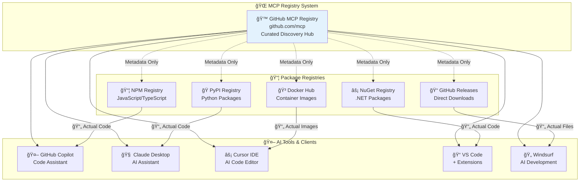
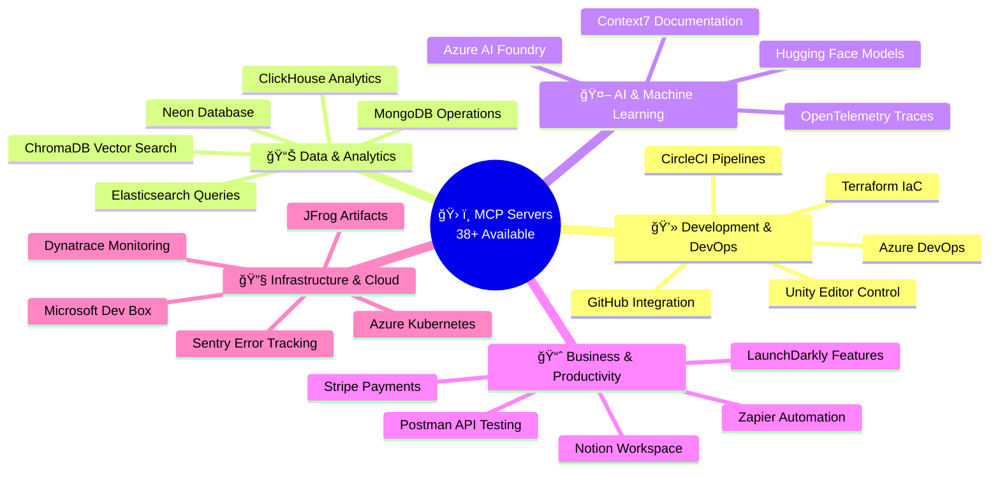

```mermaid
sequenceDiagram
    participant 👨â€ğŸ’» as Developer
    participant ğŸ› ï¸ as MCP Publisher CLI
    participant 🙠as GitHub API
    participant 🌠as MCP Registry
    participant 📦 as Package Registry
    
    👨â€ğŸ’»->>🛠ï¸: mcp-publisher publish server.json
    🛠ï¸->>ğŸ™: 🔠OAuth Authentication Request
    ğŸ™-->>🛠ï¸: 🫠Access Token
    🛠ï¸->>ğŸ™: ✅ Verify Repository Ownership
    ğŸ™-->>🛠ï¸: ✅ Ownership Confirmed
    
    🛠ï¸->>📦: 🔠Verify Package Exists
    📦-->>🛠ï¸: ✅ Package Found
    
    🛠ï¸->>ğŸŒ: 📤 Submit Server Metadata
    ğŸŒ->>ğŸŒ: 🔠Schema & Security Validation
    ğŸŒ-->>🛠ï¸: 🉠Publication Successful
    🛠ï¸-->>👨â€ğŸ’»: ✅ Server Published & Available!
    
    Note over 👨â€ğŸ’»,📦: Entire process takes ~2-5 minutes
```

# 🚀 GitHub MCP Registry: The Ultimate Guide to AI Agent Integration

<div align="center">


**Connect AI models to the real world through standardized protocols**

[](https://github.com/modelcontextprotocol/registry)
[](https://registry.modelcontextprotocol.io)
[](https://github.com/mcp)

[🌐 Browse Registry](https://github.com/mcp) • [📖 Documentation](https://modelcontextprotocol.io) • [🛠️ Publish Server](https://registry.modelcontextprotocol.io) • [💬 Community](https://discord.gg/modelcontextprotocol)

</div>

---

## 📋 Table of Contents

- [🎯 What is MCP Registry?](#-what-is-mcp-registry)
- [🏗️ Architecture Overview](#️-architecture-overview)
- [🌟 Key Features](#-key-features)
- [📊 Registry Ecosystem](#-registry-ecosystem)
- [🔧 Available MCP Servers](#-available-mcp-servers)

- [📤 Publishing Your Server](#-publishing-your-server)

- [🏆 Success Stories](#-success-stories)

---

## 🎯 What is MCP Registry?

The **Model Context Protocol (MCP) Registry** is a revolutionary platform that launched in September 2025 to solve the critical problem of fragmented AI agent integration. Before MCP Registry, AI developers faced:

❌ **Scattered MCP servers** across numerous registries  
❌ **Random repositories** buried in community threads  
❌ **Security risks** from unverified sources  
❌ **Duplicated effort** maintaining multiple distributions  

✅ **MCP Registry provides:**
- **Centralized Discovery**: One place to find all MCP servers
- **Curated Quality**: Vetted servers from trusted sources  
- **Easy Integration**: One-click setup with AI tools
- **Unified Ecosystem**: Seamless interoperability

---

## 🏗️ Architecture Overview

### MCP Registry Architecture



### How MCP Registry Works as a Metaregistry

The registry doesn't actually host your code. It's a 'metaregistry' - it stores metadata about packages, but the actual code comes from traditional package registries.

```mermaid
graph LR
    subgraph "🔍 Discovery Layer"
        MR[🐙 MCP Registry<br/>github.com/mcp<br/>Metadata & Discovery]
    end
    
    subgraph "📦 Package Registries"
        NPM[📦 NPM<br/>JavaScript/TypeScript]
        PYPI[🐍 PyPI<br/>Python Packages]
        DOCKER[🐳 Docker Hub<br/>Container Images]
        NUGET[⚡ NuGet<br/>.NET Packages]
    end
    
    subgraph "🤖 Developer Workflow"
        DEV[👨‍💻 Developer]
        AI[🤖 AI Tool]
        CODE[💻 Actual Code]
    end
    
    DEV -->|1. Browse & Discover| MR
    MR -.->|Metadata Only| NPM
    MR -.->|Metadata Only| PYPI
    MR -.->|Metadata Only| DOCKER
    MR -.->|Metadata Only| NUGET
    
    DEV -->|2. Install Server| AI
    AI -->|3. Download Package| NPM
    AI -->|3. Download Package| PYPI
    AI -->|3. Download Package| DOCKER
    AI -->|3. Download Package| NUGET
    
    NPM -->|4. Actual Code| CODE
    PYPI -->|4. Actual Code| CODE
    DOCKER -->|4. Actual Code| CODE
    NUGET -->|4. Actual Code| CODE
    
    style MR fill:#e3f2fd
    style CODE fill:#e8f5e8
```



When you install an MCP server, the registry tells your AI tool where to find it - whether that's NPM for JavaScript, PyPI for Python, Docker Hub for containers, or NuGet for .NET. Then your tool downloads the actual code from those established, trusted package ecosystems.

This approach leverages existing infrastructure while providing the discoverability layer that was missing. It's the best of both worlds.

---

## 🌟 Key Features

### 🎯 For Developers Using MCP Servers

| Feature | Benefit | Example |
|---------|---------|---------|
| **🔍 Centralized Discovery** | Find all servers in one place | Browse 38+ servers by category |
| **⚡ One-Click Installation** | Instant setup with AI tools | Install GitHub server with single click |
| **🛡️ Security Validation** | Trusted, vetted sources | Cryptographic signatures on Docker images |
| **📚 Rich Documentation** | Complete setup guides | Step-by-step integration examples |
| **🔄 Version Management** | Track updates and changes | Semantic versioning across all servers |

### 🛠️ For MCP Server Creators

| Feature | Benefit | Example |
|---------|---------|---------|
| **📤 Unified Publishing** | Publish once, reach all consumers | Single submission appears everywhere |
| **🔒 Namespace Protection** | Secure ownership validation | GitHub OAuth prevents impersonation |
| **📊 Usage Analytics** | Track adoption and performance | Download stats and integration metrics |
| **🚀 Automated CI/CD** | Streamlined release process | GitHub Actions auto-publishing |
| **🌐 Global Distribution** | Worldwide accessibility | CDN-backed delivery |

---

## 📊 Registry Overview

### Server Categories & Use Cases



---

## 🔧 Available MCP Servers

### 🔥 Top Featured Servers

<table>
<tr>
<th>🏆 Server</th>
<th>📝 Description</th>
<th>🛠️ Key Tools</th>
<th>🔗 Integration</th>
</tr>
<tr>
<td><strong>🐙 GitHub MCP</strong></td>
<td>Official GitHub integration for repositories, issues, PRs, and workflows</td>
<td>repo_read, issue_create, pr_analyze, workflow_monitor</td>
<td>One-click Copilot setup</td>
</tr>
<tr>
<td><strong>🧠 ChromaDB MCP</strong></td>
<td>Vector database for semantic search and knowledge management</td>
<td>collection_create, document_add, vector_search, metadata_filter</td>
<td>Claude Desktop, VS Code</td>
</tr>
<tr>
<td><strong>🌐 Context7 MCP</strong></td>
<td>Up-to-date documentation and code examples from any library</td>
<td>doc_fetch, example_search, version_check</td>
<td>Universal MCP clients</td>
</tr>
<tr>
<td><strong>🚀 Postman MCP</strong></td>
<td>API testing and automation through natural language</td>
<td>collection_run, environment_manage, test_automate</td>
<td>Claude, Cursor, Windsurf</td>
</tr>
<tr>
<td><strong>🏗️ Terraform MCP</strong></td>
<td>Infrastructure as Code management and automation</td>
<td>plan_generate, apply_changes, state_inspect</td>
<td>GitHub Copilot, VS Code</td>
</tr>
</table>

### 📈 Usage Statistics


---

## 📤 Publishing Your Server

### 🎯 Publishing Workflow


### 🛠️ Step-by-Step Publishing Guide

#### 1️⃣ Install Publisher CLI

**macOS/Linux:**
```bash
curl -L "https://github.com/modelcontextprotocol/registry/releases/download/v1.0.0/mcp-publisher_1.0.0_$(uname -s | tr '[:upper:]' '[:lower:]')_$(uname -m | sed 's/x86_64/amd64/;s/aarch64/arm64/').tar.gz" | tar xz mcp-publisher && sudo mv mcp-publisher /usr/local/bin/
```

**Windows (PowerShell):**
```powershell
$arch = if ([System.Runtime.InteropServices.RuntimeInformation]::ProcessArchitecture -eq "Arm64") { "arm64" } else { "amd64" }
Invoke-WebRequest -Uri "https://github.com/modelcontextprotocol/registry/releases/download/v1.0.0/mcp-publisher_1.0.0_windows_$arch.tar.gz" -OutFile "mcp-publisher.tar.gz"
```

#### 2️⃣ Server Configuration (server.json)

```json
{
  "name": "awesome-ai-assistant",
  "description": "AI-powered development assistant with advanced code analysis capabilities",
  "version": "2.1.0",
  "author": {
    "name": "Your Name",
    "email": "you@example.com",
    "url": "https://github.com/username"
  },
  "repository": {
    "type": "git",
    "url": "https://github.com/username/awesome-ai-assistant"
  },
  "license": "MIT",
  "packages": [
    {
      "registry_name": "npm",
      "package_name": "@username/awesome-ai-assistant",
      "install_command": "npx @username/awesome-ai-assistant"
    },
    {
      "registry_name": "pypi", 
      "package_name": "awesome-ai-assistant",
      "install_command": "uvx awesome-ai-assistant"
    }
  ],
  "tools": [
    "analyze_code_patterns",
    "generate_documentation", 
    "detect_vulnerabilities",
    "suggest_optimizations",
    "create_tests"
  ],
  "resources": [
    "code_examples",
    "best_practices",
    "documentation_templates"
  ],
  "capabilities": {
    "embedding_functions": ["openai", "cohere"],
    "streaming": true,
    "batch_processing": true
  }
}
```

#### 3️⃣ Publishing Commands

```bash
# Publish to registry
mcp-publisher publish ./server.json

# Validate before publishing
mcp-publisher validate ./server.json

# Check publishing status
mcp-publisher status your-server-name
```

### 🔐 Authentication Flow




---

## 🛠️ Development Tools

### 🔍 MCP Inspector Tool

The **MCP Inspector** is essential for validating your server before publishing:

```bash
# Install the inspector
npm install -g @modelcontextprotocol/inspector

# Test your server
npx @modelcontextprotocol/inspector npx your-server-name

# Or test locally
npx @modelcontextprotocol/inspector node server.js
```

**Inspector Features:**
- 🔍 **Real-time Tool Testing**: Interactive tool execution
- 📊 **Performance Metrics**: Response time analysis  
- 🛡️ **Security Validation**: Protocol compliance checking
- 📝 **Documentation Generation**: Auto-generated tool docs

### 🏗️ Development Commands

```bash
# Community Registry Development
git clone https://github.com/modelcontextprotocol/registry
cd registry

# Start development environment
make dev-compose          # Docker Compose with MongoDB
make dev-local            # Local development

# Build tools
make build                # Build registry application
make publisher            # Build publisher CLI

# Testing & Validation
make test-unit            # Unit tests with coverage
make test-integration     # Integration tests
make test-endpoints       # API endpoint testing
make check               # All checks (lint + tests)

# Code quality
make lint                 # Run linter (CI equivalent)
make lint-fix            # Auto-fix linting issues
```

### 📊 API Documentation

Live API documentation available at: **[registry.modelcontextprotocol.io/v0/swagger](https://registry.modelcontextprotocol.io/v0/swagger/index.html)**

**Key Endpoints:**
- `GET /v0/servers` - List all servers with pagination
- `GET /v0/servers/{id}` - Get specific server details
- `POST /v0/servers` - Publish new server (authenticated)
- `PUT /v0/servers/{id}` - Update server (authenticated)
- `DELETE /v0/servers/{id}` - Remove server (authenticated)


---

## 🏆 Success Stories

### 📈 Registry Growth Metrics


### 🎉 Community Impact

- **🚀 38+ MCP Servers**: Covering all major development workflows
- **🏢 Enterprise Adoption**: Deployed in production environments  
- **🔧 Daily Integrations**: New server installations growing
- **⭐ High Satisfaction**: Positive developer feedback

---

## 🔗 Quick Links & Resources

<div align="center">

### 🌟 Essential Links

[](https://github.com/mcp)
[](https://registry.modelcontextprotocol.io)
[](https://modelcontextprotocol.io)

[](https://discord.gg/modelcontextprotocol)
[](https://github.com/modelcontextprotocol/registry/discussions)
[](https://twitter.com/modelcontextprotocol)

</div>

### 🎯 Getting Started Checklist

- [ ] 🔍 **Explore** the GitHub MCP Registry
- [ ] 🧪 **Install** ChromaDB MCP for testing
- [ ] 🛠️ **Configure** your preferred AI tool
- [ ] 📚 **Read** the MCP specification
- [ ] 🚀 **Build** your first MCP server
- [ ] 📤 **Publish** to the registry
